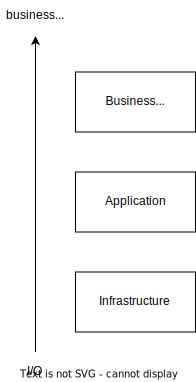
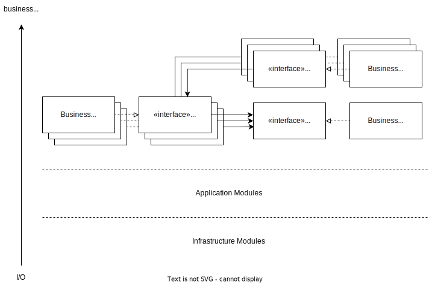
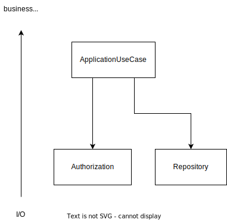
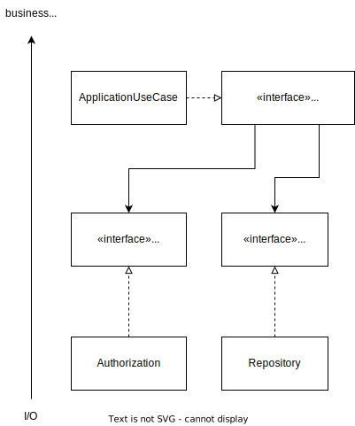
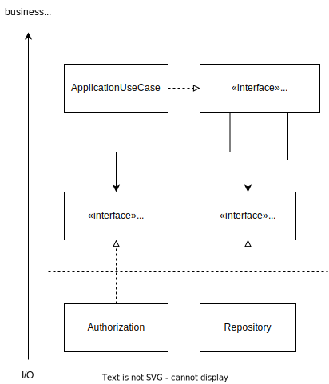
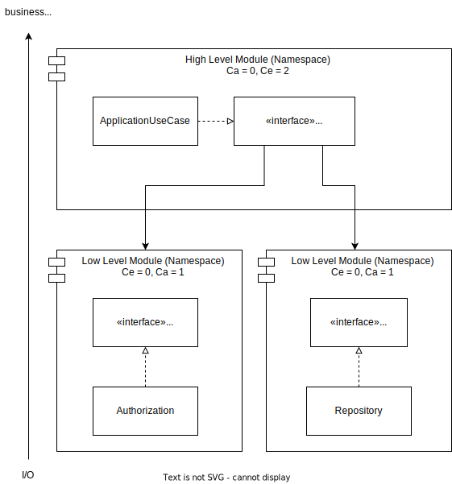
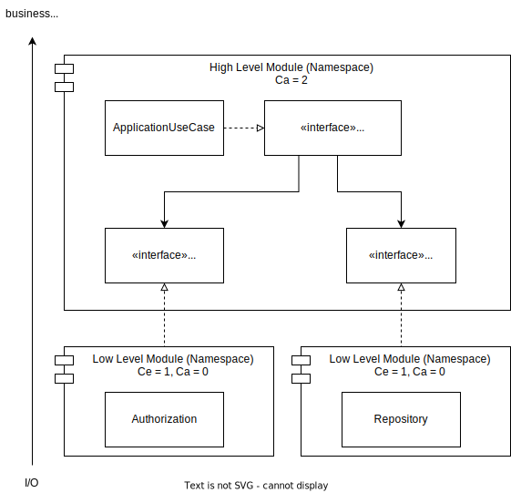

## Введение

Dependency Inversion Principle (далее DIP) описывает правила согласно которым должны взаимодействовать между собой модули (или любые другие структурные блоки, которые предоставляет ваш язык программирования) в границах кода приложения. DIP напрямую влияет на декомпозицию кода, предлагая удобные (хоть и имплицитные) критерии для организации зависимостей и выстраивания иерархии модулей. Что делает его пожалуй самым важным из принципов SOLID, на котором стоит (должна стоять, sad but true) разработка программ в объектно-ориентированной парадигме.

Задача, стоящая перед настоящим текстом, это придать объем DIP и дать вам силы жить с этим дальше, продемонстрировав как из лаконичных дефиниций принципа следуют правила по организации кода. В статье будут разобраны определения DIP, рассмотрено применение принципа на примерах декомпозиции классов в модули и выстраивания зависимостей между ними, определены, упомянутые выше, критерии. Всё это, как я надеюсь, даст вам понятную модель организации зависимостей, которую вы сможете применять на практике.   

## Декомпозиция формулировок и классификация кода

Известно два каноничных определения DIP от его автора — Robert Martin:

1. Определение от 1994...1996 годов (далее определение №1):

>A. High level modules should not depend upon low level modules. Both should depend upon abstractions.
>
>B. Abstractions should not depend upon details. Details should depend upon abstractions.
>
\- [Martin R. The Dependency Inversion Principle](https://web.archive.org/web/20150905081103/http://www.objectmentor.com/resources/articles/dip.pdf)

2. Определение от 2020 года (далее определение №2):
> Depend in the direction of abstraction. High level modules should not depend upon low level details.
>
\- [Martin R. Solid Relevance](https://blog.cleancoder.com/uncle-bob/2020/10/18/Solid-Relevance.html)

Другие определения DIP будут приведены при необходимости по ходу статьи. И здесь же, перед погружением, необходимо оговориться о том, что понимать слово *module* следует как некий структурный элемент кода. В зависимости от вашего языка программирования и широты контекста это может быть класс, пространство имен, пакет или действительно модуль (привет, Java). На самом деле это не должно вас смутить, ведь не зависимо от того какие возможности предлагает ваш язык для организации структуры кода, DIP сохраняет применимость к организации зависимостей на любом уровне инкапсуляции.

Начнем разбор каноничных формулировок DIP с той части, где упоминается про модули и детали — *high level modules should not depend upon low level modules (details)* (по нюансам различий между модулями и деталями пройдемся поздней).

Если мы попытаемся применить эту часть определений DIP к коду, то обнаружим, что нам навязывается «пространственная» лексика — появляется некоторая «вертикальность»: high level modules и low level modules (details); и, шире, иерархичность (... should not depend upon...). Это приводит к тому, что наша будущая модель отношений между модулями получает дополнительное измерение — вертикальную ось, относительно которой измеряется «уровень» модуля, определяется «низкоуровневость» деталей и выстраивается иерархия модулей. Далее, чтобы использовать DIP нам необходимо найти объекты, к которым будет применяться принцип. Для этого нам нужно выделить в коде приложения модули, а затем расположить модули относительно вертикальной оси (далее эту ось мы будем называть уровнем абстракции). Представим, что у нас уже есть код некоторого приложения, к которому мы и будем применять DIP.

Задачу выделения модулей и построения модели зависимостей, начнем решать с распределения кода относительно оси уровня абстракции. Для этого нам необходимо классифицировать код, который можно встретить в (почти любом) приложении. А так как уровень абстракции определяется назначением кода (Мартин Р. Чистая архитектура. Искусство разработки программного обеспечения. СПб.: Питер, 2020. С. 187), то и классификацию будем проводить по этому основанию.  

По назначению код приложения можно разделить на 3 категории:

* Бизнес-правила (бизнес-логика). Код, который является представлением сущностей предметной области и обслуживает интересы бизнеса. Собственно, это тот код, ради которого вы начали писать приложение.
* Код приложения. Код, появившийся потому что мы пишем это приложение. Код, который обслуживает инстанциирование бизнес-правил и передает «выхлоп» от работы логики этих правил куда-то еще.
* Инфраструктурный код. Код, который обеспечивает взаимодействие с различными I/O устройствами и потоками — драйверами для различного ПО, файловой системой, web-сервером, standard streams, etc.

Наложив выделенные категории на ось уровеня абстракции, получим следующее распределение (рис. 1).

Рисунок 1 — Категории кода относительно уровня абстракции

Выше остальных категорий по оси располагаются высокоуровневые бизнес-правила (high level), а внизу устройства ввода/вывода и код, который обеспечивает с ними взаимодействие (low level).
Распределение на рис. 1 показывает насколько та или иная категория кода отстоит от решения бизнес-задач и обслуживает задачи ввода и вывода или наоборот — насколько далек код от взаимодействия с вводом/выводом и в какой степени решает бизнес-задачи. Именно удаленностью от ввода/вывода характеризуется уровень абстракции: чем дальше код от I/O, тем выше у него уровень абстракции.  

Особенностью большинства подходов к написанию кода является то, что классификация по назначению не всегда соответствует (почти никогда) реальной декомпозицию кода в приложениях (тем не менее даже если ваш код написан в процедурном стиле, в нем можно выделить соответсвующие категории). И так же очевидно, что присутствует необходимость (продиктованная Single Responsibility Principle и здравым смыслом) поддерживать разделение кода по назначению и не смешивать бизнес-логику и низкоуровневую механику. Собственно эта необходимость и заставляет нас пользоваться теми инструментами, которые предлагает язык программирования, для того чтобы группировать специализированный код. Таким образом у нас и появляются модули, которые решают какие-то задачи.   

Итак, код нашего гипотетического приложения мы сгрупировали в модули, модули у нас специализированные, то есть решают задачи находящиеся на разных уровнях абстракции: кто-то в базу данных ходит (low level), а кто-то считает скидку на заказ в интернет-магазине у конкретного пользователя (high level). Это значит что мы разобрались с «вертикальностью» и самое время идти дальше. А дальше нам необходимо выстроить взаимодействие (построить иерархию) между этими модулями.
И поможет нам в этом дальнейшее прочтение определений DIP: *depend in the direction of abstraction* (определение №2). Или более подробно в определении №1 : *Both (high and low level modules) should depend upon abstractions*. И абстракция здесь это контракт выделенный в абстрактный класс или интерфейс. Потребность проводить зависимости через абстракции проистекает из того, что контракт более стабилен, чем его конкретная реализация и изменение (или подмена) реализации не должна приводить к изменению контракта. Иными словами контракт определяет потребность, а абстракция это истина, которая не будет меняться со временем. Определение №1 так же выдвигает требование к организации зависимостей абстракции *Abstractions should not depend upon details. Details should depend upon abstractions* — абстракция должна зависить от абстракции, зависимость абстракции от конкретных деталей недопустима.   

Вообще, *depend in the direction of abstraction* это самая популярная часть определения, которой иногда ограничивают весь DIP, что приводит к его наивному пониманию. Казалось бы, определяй зависимости через интерфейсы и вот он DIP. Однако, без учета уровня абстракции, на котором расположен код, передавать зависимости через интерфейс не то чтобы было в целом бессмысленно, но такой подход не является реализацией DIP. Учитывать уровень абстракции (задачи, которые решает код) необходимо для выстраивания правильного направления зависимостей.  

И здесь я приведу еще одну формулировку, которая прямо об этом говорит:

> - Abstractions should not depend on details
> - Code should depend on things that are at the same or higher level of abstraction
> - High level policy should not depend on low level details
> - Capture low-level dependencies in domain-relevant abstractions
>
\- [Schuchert B. L. DIP in the Wild](https://martinfowler.com/articles/dipInTheWild.html)

Цитата выше дополняет нашу картину самым важным постулатом, который неявно следует из каноничных формулировок DIP — абстракция, от которой зависит код, должна находиться либо на одном уровне с кодом, либо на более высоком.
Таким образом, общее направление зависимостей в приложении должно стремиться к наиболее удаленному от устройств ввода/вывода коду. Что инкапсулирует выскоуровневый код, делая его стабильным, защищенным от изменений за счет абстрагирования от низкоуровневой механики.  

Еще одно следствие из постулата добавленного выше: на одном уровне может быть сколько угодно зависимых друг от друга модулей и это не будет нарушением DIP (рис. 2).

Рисунок 2 — Зависимость модулей одного уровня

Однако, следует помнить, что на зависимости между одноуровневыми модулями могут накладываться явные и неявные ограничения архитектурными парадигмами (hexagonal architecture, clean architecture) и подходами к декомпозиции (DDD, упомянутый уже здравый смысл, etc.), которые не являются предметом данной статьи.
Необходимо оговориться, что в полной мере следование DIP невозможно, ввиду наличия конкретных деталей, предоставляемых языком программирования. Конечно, можно посчитать условный класс String в условном языке программирования низкоуровневым механизмом, и провести взаимодействие между ним и бизнес-логикой через все уровни абстракции, будто это какой-нибудь драйвер для базы данных. Но смысла в этом исчезающе мало, так как классы, которые предоставляет язык программирования обычно достаточно стабильны и нам не нужно защищать бизнес-логику от их изменчивости (Мартин Р. Чистая архитектура. Искусство разработки программного обеспечения. СПб.: Питер, 2020. С. 101). Поэтому следует определить область действия DIP: принцип применяется к тому коду, который пишет непосредственно разработчик.

### О low level modules и low level details
В определении №1 и №2 модули и детали упомянуты в равнозначном контексте и думаю, что это требует отдельного пояснения. Обычно деталями называют реализацию абстракции, но в контексте DIP модуль и деталь это пересекающиеся до определенного предела понятия.  

Любой код, кроме самых высоких абстракций, становится деталью по отношению к уровням выше, так как является реализацией высокоуровневой логики, определяющей к нему требования (если смотреть с любого нижнего уровня на верхний уровень, то последний будет абстракцией). И любой код так же является модулем (классом, namespace), так как это определяется семантикой языка программирования, а не иерархическими взаимоотношениями между уровнями абстракции.

## Инверсия
А где, собственно, инверсия? Почему и зачем инверсия?  Чтобы ответить на эти вопросы рассмотрим отношения между классами с явным нарушением DIP. Для примера возьмем условный ApplicationUseCase, который для реализации своих задач требует Repository и Authorization (рис. 3).

Рисунок 3 — Зависимость от деталей

Зависимости направлены против оси уровня абстракции сверху вниз: ApplicationUseCase  напрямую зависит от реализации Authorization и Repository. Изменения,  которые произойдут в этих классах, будут влиять на все что находится  выше, что делает бизнес-логику нестабильной.

Попробуем исправить это, применив DIP к текущим классам (рис. 4).

Рисунок 4 — Зависимость деталей от абстракции

Проведя зависимости от классов Authorization и Repository через интерфейсы, мы инвертировали общее направление зависимостей (относительно рис. 3), направив зависимости в сторону высокоуровневых абстракций. Теперь классовая декомпозиция на рис. 4 соответствует DIP — высокоуровневый код не зависит от конкретной реализации, а, как и детали, зависит от абстракции.

Инвертировав направление зависимостей, мы привели код в состояние, в котором высокоуровневые абстракции управляют низкоуровневым кодом посредством определения требований в интерфейсах. Инверсия позволяет сконцентрировать разработку вокруг задач, которые выполняет конкретный уровень абстракции, реализовав подход from top to bottom. Начав разработку с описания высокоуровневой бизнес-логики и use cases, в виде контрактов, ей необходимых и переходя к нижним уровням, реализующие эти use cases и, в свою очередь, задающие новые контракты для еще более нижних уровней. Использование контрактов для определения требований к деталям и выстраиваемая иерархия уровней приводит к тому, что любой низкоуровневый код или механизм (база данных, web-сервер, брокер) превращается в своего рода плагин, который можно заменить.

## Coupling, интерфейсы и еще раз инверсия
Во время разработки приложения перед программистом встает ряд задач, решить которые возможно только с помощью правильной компоновки кодовой базы. Это и задачи связанные с объединением изменчивых аспектов предметной области в отдельные модули для более легкой поддержки, и обеспечение стабильности высокоуровневых абстракций, и создание расширяемой архитектуры программного обеспечения, и многие другие. Решая эти задачи разработчик так или иначе вынужден проводить границы в своем коде, компонуя код в модули.  

Контракт является «природной» границей между модулями, контракт так же может отделять и уровни абстракции друг от друга. На рис. 5 пунктирной линией проведена граница между высокоуровневой абстракцией и ее имплементацией.

Рисунок 5 — Граница между уровнями

Уровень абстракции по определению включает в себя множество модулей и делит код только «горизонтально». Поэтому компонуя код и проводя границы, мы оперируем понятием модуля или пространства имен (если решим, что пространство имен подходящий аналог для этих целей, в интерпретируемых языках программирования модуль это конвенция; здесь и далее модуль и пространство имен равнозначные понятия), как структурной единицей языка программирования подходящей для наших целей. Так же не всегда зависимость между модулями будет пересекать границы уровня абстракции, так как DIP не накладывает ограничения на одноуровневые зависимости.  

Кроме того нужно помнить, что уровень абстракции понятие относительное и по большому счету зависит от конкретного приложения, поэтому классифицировать код можно на большее или меньшее число категорий, чем это предложено в данной статье. Таким образом, уровень абстракции подходит в качестве ориентира для выстраивания правильного направления зависимостей, но для описания отношения между модулями и их компоновки необходимы более точные критерии. И такие критерии существуют, определяемые через [метрики кода](https://en.wikipedia.org/wiki/Software_package_metrics).  

Применяя инверсию зависимостей мы желаем абстрагировать высокоуровневые модули, сделать их более устойчивыми. Метрика afferent coupling поможет выразить свойство «устойчивости» модуля: высокое число использований кода гарантирует, что его будет трудно менять. Так как задача DIP это «защита» бизнес-логики от влияний низкоуровневого кода через абстрагирование, то логично предположить, что afferent coupling высокоуровневых модулей должен расти, при применении DIP.  
Еще одна метрика instability, наоборот выражает «неустойчивость» модуля, instability это отношение efferent coupling к afferent coupling. Соответственно, метрика у модулей должна уменьшаться в направлении высокоуровневых абстракций (Мартин Р. Чистая архитектура. Искусство разработки программного обеспечения. СПб.: Питер, 2020. С. 133).

Однако, при попытке посчитать coupling между модулями мы можем столкнуться с интересной коллизией компоновки. Если расположить интерфейс за пределами модуля, то метрика efferent coupling увеличится на число вынесенных за модуль контрактов, а afferent coupling, вместо ожидаемого увеличения, не изменится или уменьшится (рис. 6). Как следствие instability (на рис. 6 «I») верхнеуровнего модуля будет расти.

Рисунок 6 — Неправильная компоновка модулей

В текущей компоновке модулей проявилась такая же проблема как на рис. 3 — абстракция стала зависеть от деталей, так как модуль скомпонован так, что  интерфейс лежит рядом с деталями. Идея компоновать контракт и реализацию в одном модуле может и выглядит логично, но приводит к деинверсии зависимостей, так как уменьшает устойчивость вехнеувровневых абстракций, увеличивая их efferent coupling и, как следствие, instability. Располагая контракт в конкретном  модуле мы наделяем модуль ответственностью за него — контракт,  находящийся в модуле, обслуживает требования модуля. И в случае  расположения интерфейса, описывающего требования выскоуровневого модуля, в низкоуровневом коде инверсии зависимости не может быть, так как  состояние, когда высокоуровневая абстракция управляет требованиями, потеряно. 

Поменяем компоновку модулей и снова посчитаем метрики (рис. 7).

Рисунок 7 — Правильная компоновка модулей

Если вернуть ответственность за формирование требований к низкоуровневому коду бизнес-логике, то afferent coupling у высокоуровневого модуля увеличится, а instability уменьшится. При такой компоновке бизнес-логика станет более устойчива (абстрагированна), а отношения зависимостей инвертировано. Из чего следует, что интерфейс, определяющий требования модуля к низкоуровневым деталям, является неотъемлемой частью модуля и должен быть скомпонован внутри него.

## Заключение

Рассмотрев DIP и те правила, которые накладывает ограничения на наш код при применении принципа, вблизи, мы подошли к тому, что можем выделить некоторые критерии для декомпозиции кода приложения в модули (распределения по namespaces).
 
Можно выделить четыре таких критерия:

1. Иерархические отношения между уровнями абстракции — выскоуровневые модули управляют, посредством требований, тем, что происходит на нижних уровнях.
2. Управление требованиями — правильная инверсия зависимостей заключается в передаче обязанности формирования контрактов на более высокий уровень абстракции.
3. Coupling модуля — модули верхних уровней абстракции должны иметь низкий efferent coupling и высокий afferent coupling, это сделает их много более независимыми от остального кода и позволит им управлять всем приложением.
4. Выделенная высокоуровневая абстракция (бизнес-логика) — лучше всего начинать инвертировать зависимости с выделения модулей находящихся на самом высоком уровне абстракции и после переходить к реализации их требований, проходя уровень за уровнем вниз. Такой подход даст нам два преимущества: А. Мы сможем контролировать coupling модулей. B. На самом верху окажутся модули имеющие efferent coupling равный 0, что в свою очередь дает преимущество в дизайне классов и тестировании. 

## Источники 

1. [Martin R. The Dependency Inversion Principle](https://web.archive.org/web/20150905081103/http://www.objectmentor.com/resources/articles/dip.pdf)
2. [Martin R. Solid Relevance](https://blog.cleancoder.com/uncle-bob/2020/10/18/Solid-Relevance.html)
3. Мартин Р. Чистая архитектура. Искусство разработки программного обеспечения. СПб.: Питер, 2020
4. [Schuchert B. L. DIP in the Wild](https://martinfowler.com/articles/dipInTheWild.html)
5. [Wikipedia Software package metrics](https://en.wikipedia.org/wiki/Software_package_metrics)
